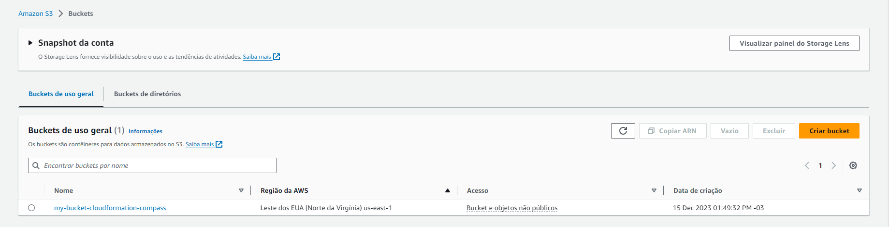
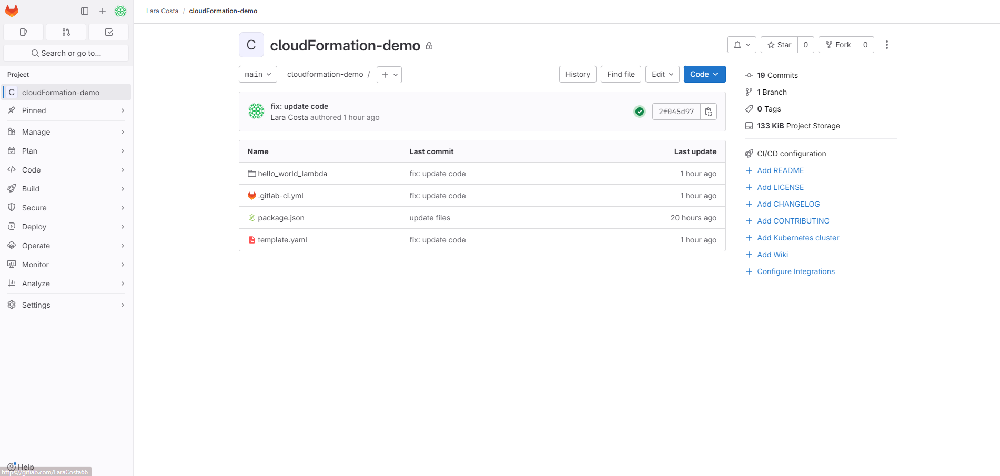
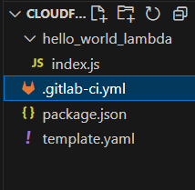
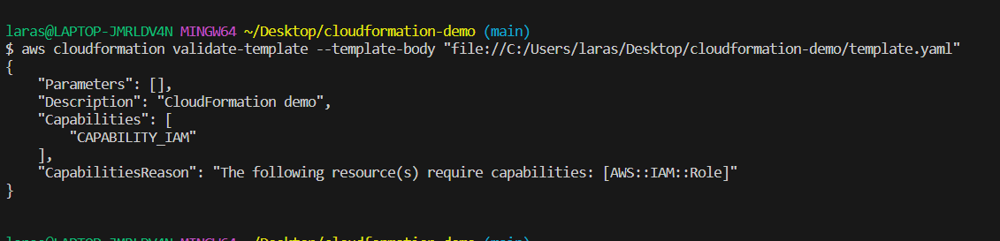
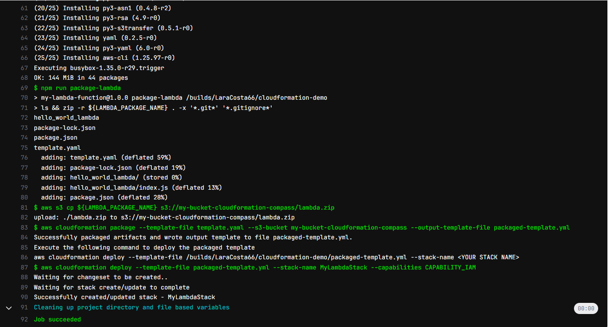

# compass-cloudformation-lambda

### Crie um Bucket no S3
- Clique em **Criar Bucket**, e de um nome ao seu Bucket
- Em seguida, ele será criado e aparecerá na sua dashboard



## Crie um projeto no Gitlab para fazer o deploy
- Em **Projetos**, clique em **New Project**
- Selecione a opção **Create Blank Project**
- Dê um nome ao seu **Projeto**, escolha a privacidade dele e clique em **Create Project**



### No VSCode
1. Clone o repositório na sua máquina
- Crie um pasta com nome **hello_world_lambda**
- Dentro dela, crie um arquivo **index.js**
- No Arquivo **index.js**, crie a função para o **"Hello world"**:

```
exports.handler = function(event, context) {
    context.succeed('Hello, World! I am a lambda function');    
};
```

- Na raiz do **Projeto**, crie um arquivo **package.json**:

```
{
    "name": "my-lambda-function",
    "version": "1.0.0",
    "main": "index.js",
    "scripts": {
      "package-lambda": "ls && zip -r ${LAMBDA_PACKAGE_NAME} . -x '*.git*' '*.gitignore*'"
    },
    "dependencies": {},
    "devDependencies":{}
}
```



## CloudFormation

- Crie um arquivo **template.yaml**
- Adicione nesse arquivo, as **funções lambdas**
- Dentro desse arquivo adicione o **bucket s3** que criou anteriormente

```
AWSTemplateFormatVersion: 2010-09-09
Description: "CloudFormation demo"
Resources:
  lambdaFunctionRole:
    Type: AWS::IAM::Role
    Properties:
      AssumeRolePolicyDocument:
        Version: "2012-10-17"
        Statement:
          - Effect: Allow
            Principal:
              Service: lambda.amazonaws.com
            Action: sts:AssumeRole
      Policies:
        - PolicyName: "demo-lambda-policy"
          PolicyDocument:
            Version: "2012-10-17"
            Statement:
              - Effect: "Allow"
                Action:
                  - "logs:CreateLogGroup"
                  - "logs:CreateLogStream"
                  - "logs:PutLogEvents"
                  - "s3:GetObject"
                Resource: "*"
  lambdaFunction:
    Type: AWS::Lambda::Function
    Properties:
      Description: "CloudFormation demo lambda"
      FunctionName: hello-world-demo
      Handler: hello_world_lambda/index.handler
      MemorySize: 128
      Role: !GetAtt lambdaFunctionRole.Arn
      Runtime: nodejs14.x
      Timeout: 30
      Code:
        S3Bucket: my-bucket-cloudformation-compass
        S3Key: lambda.zip
      Tags:
        - Key: keyname
          Value: value
```

## Gitlab
- Crie um o arquivo **.gitlab-ci.yml**
- e Adicione o script para o Deploy

```
stages:
  - deploy

variables:
  AWS_DEFAULT_REGION: "us-east-1"
  LAMBDA_PACKAGE_NAME: "lambda.zip"

before_script:
  - npm install
  - apk update
  - apk add zip
  - which zip
  - apk add --no-cache aws-cli

deploy_lambda:
  image: node:14-alpine
  stage: deploy
  script:
    - npm run package-lambda
    - aws s3 cp ${LAMBDA_PACKAGE_NAME} s3://my-bucket-cloudformation-compass/lambda.zip
    - aws cloudformation package --template-file template.yaml --s3-bucket my-bucket-cloudformation-compass --output-template-file packaged-template.yml
    - aws cloudformation deploy --template-file packaged-template.yml --stack-name MyLambdaStack --capabilities CAPABILITY_IAM

```
**1. Depois de adicionar todos esses arquivos, verifique se está tudo certo com o template aws, usando o comando no terminal:**

```
aws cloudformation validate-template --template-body "file://C:CAMINHO-PARA-O-ARQUIVO-TEMPLATE"
```
- Se estiver tudo certo com o seu template, uma resposta parecida com essa será enviada:



2. Agora suba esses arquivos para o seu repositório, para iniciar a pipeline.
```
git status 
git add .
git commit -m "feat:mensagem do commit"
git push origin main
```
### Pipeline



- Você pode checar no seu **console aws** se stack foi criada no **cloudFormation**
- e também se o **s3 bucket** recebeu um arquivo